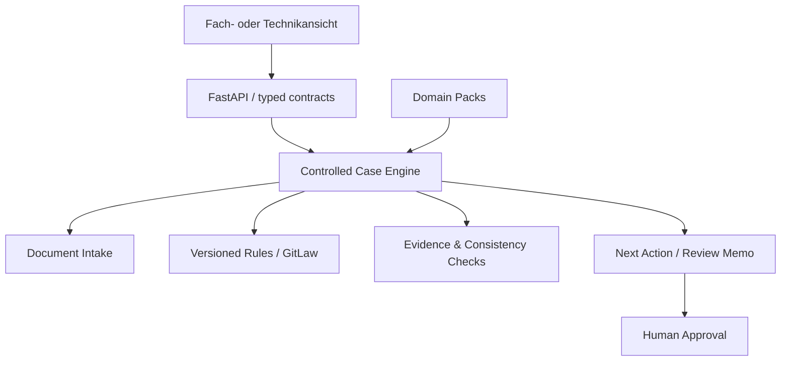

# PrüfPilot V5.1 — Case Engine für nachvollziehbare Verwaltungsprozesse

> Unabhängige Bewerbungs-Arbeitsprobe für die AI-Engineer-Rolle bei aconium.  
> Kein allgemeiner PDF-Chat, sondern ein enger, testbarer Reviewer-Workflow mit drei synthetischen Verwaltungsdomänen.

[](https://pruefpilot-aconium.vercel.app)
[](https://pruefpilot-v5-api.vercel.app/api/docs)
[](LICENSE)

## Live

- **V5.1 Produkt:** https://pruefpilot-aconium.vercel.app
- **V5 Case API:** https://pruefpilot-v5-api.vercel.app
- **V5 OpenAPI:** https://pruefpilot-v5-api.vercel.app/api/docs
- **V3 Full Document-AI Backend:** https://pruefpilot-document-ai.vercel.app
- **V3 OpenAPI:** https://pruefpilot-document-ai.vercel.app/api/docs

Alle Fälle, Personen, Dokumente und Beträge sind synthetisch. PrüfPilot ist nicht mit aconium verbunden und trifft keine Rechts-, Förder- oder Leistungsentscheidung.

## Der eine Satz

> PrüfPilot verbindet versionierte Regeln mit konkreten Akten, prüft Dokumente und Belege, macht Unsicherheit sichtbar und bereitet einen menschlich überprüfbaren nächsten Schritt vor.

## Warum V5.1

V3 bewies einen vollständigen Document-AI-Workflow für einen Gigabit-Förderfall. V5.1 zeigt, wie derselbe kontrollierte Kern über **Domain Packs** auf weitere Verwaltungsprobleme übertragen werden kann.

### Drei verständliche Demo-Fälle

| Fall | Nutzerfrage | Was gezeigt wird |
|---|---|---|
| **Glasfaser-Ausbau Sonnenhain** | Kann die Schlusszahlung vorbereitet werden? | Pflichtunterlagen, Betragsabgleich, Evidence States, Prompt-Injection-Quarantäne |
| **Wohngeldantrag einer vierköpfigen Familie** | Welche Unterlagen fehlen noch? | Vollständigkeit, Inkonsistenzen, gezielte Nachforderung, keine Anspruchsentscheidung |
| **Neue Vergaberegel für kommunale Schul-IT** | Welche laufenden Projekte sind betroffen? | Regelversionen, Gültigkeitszeitpunkt, Impact-Analyse und GitLaw-Brücke |

Die technischen IDs (`GF-2026-014`, `WG-DEMO-041`, `VR-DEMO-2027`) bleiben als Audit-Referenzen erhalten, stehen im Produkt aber nicht vor der menschlichen Aufgabe.

## Produktfunktionen

### V5.1 Reviewer Experience

- drei wählbare synthetische Verwaltungsfälle
- Fachansicht und Technikansicht
- freie, fallbezogene Fragen mit Quellen
- Dokumentstatus und synthetische Auszüge
- bestätigte, teilweise belegte und offene Punkte
- empfohlene nächste Aktion
- sichtbarer Domain-Pack- und Tool-Trace
- geführte 90-Sekunden-Demo
- sichtbares FAQ und Open-Source-Erklärung

### Echter Document-AI-Kern aus V3

`POST /api/upload` verarbeitet reale PDF-Bytes:

1. Dateityp und Größenlimit prüfen
2. SHA-256 bilden
3. Text mit `pypdf` extrahieren
4. Dokumenttyp klassifizieren
5. Beträge, Daten und Rechnungsnummern extrahieren
6. dokumentbasierte Prompt Injection erkennen
7. strukturierte Ausgabe speichern und im Reviewer-Workflow verwenden

### Grounded RAG und begrenzte Agents

- Retrieval über versionierte Regelabschnitte
- Zitate mit Titel, Version, Seite und Abschnitt
- Grounding Guard bei fehlender Grundlage
- bounded Completeness-, Evidence- und Review-Workflows
- sichtbare Tool-Traces und Request IDs
- Human-Approval-Gate statt autonomer Verwaltungsentscheidung

## Skalierungsmodell: Case Engine + Domain Packs



Ein Domain Pack definiert pro Fachgebiet:

```text
case_schema.json
required_documents.yaml
versioned_rules.json
deterministic_checks.py
output_templates.md
tool_permissions.yaml
retrieval_evals.json
```

So entsteht kein universeller Super-Agent, sondern ein stabiler Kern mit fachlich kontrollierten Modulen.

## GitLaw-Brücke

- **GitLaw:** Welche Regel gilt wann und was hat sich geändert?
- **PrüfPilot:** Welche konkrete Akte oder welcher Vorgang ist betroffen und welche Belege fehlen?

```text
versionierte Regel → betroffene Fälle → Evidence Check → offene Punkte → menschliche Aktion
```

## Öffentliche APIs

### V5 Case API

| Methode | Endpoint | Zweck |
|---|---|---|
| GET | `/api/health` | Version, Fallzahl und Demo-Modus |
| GET | `/api/v5/cases` | drei menschenlesbare Fälle |
| GET | `/api/v5/cases/{case_id}` | Fall, Dokumente, Findings und Domain Pack |
| POST | `/api/v5/cases/{case_id}/ask` | fallbezogene, quellenbasierte Frage |
| POST | `/api/v5/cases/{case_id}/evidence` | Aussage gegen Belege prüfen |
| POST | `/api/v5/cases/{case_id}/memo` | Review Memo und nächste Aktion |

### Vollständiger V3 Document-AI-Kern

| Methode | Endpoint | Zweck |
|---|---|---|
| POST | `/api/upload` | realer PDF-Intake |
| POST | `/api/cases/GF-2026-014/ask` | grounded RAG |
| POST | `/api/cases/GF-2026-014/completeness` | Pflichtunterlagen prüfen |
| POST | `/api/cases/GF-2026-014/evidence` | Claim ↔ Evidence |
| POST | `/api/cases/GF-2026-014/review-memo` | Prüfvermerk vorbereiten |
| POST | `/api/feedback` | Reviewer-Korrektur in Eval-Fall überführen |
| POST | `/api/benchmark/run` | deterministische Baseline und konfigurierte Provider |

## Repository-Struktur

```text
app/                    vollständiger FastAPI- und Document-AI-Kern
app/v5_cases.py         drei Domain-Pack-Fälle und kontrollierte Antworten
tests/test_v5_cases.py  V5 API- und Boundary-Tests
frontend/v5.1/          V5.1-Frontend-Stand der Live-Demo
deployments/v5-api/     separat deploybare V5 Case API
docs/                   Threat Model, Roadmap und Interview-Deck-Outline
evals/                  Retrieval-Goldfälle
demo_files/             synthetische PDF-Beispiele
```

## Schnellstart

```bash
python -m venv .venv
source .venv/bin/activate  # Windows: .venv\Scripts\activate
pip install -e ".[dev]"
pytest -q
python evals/run_evals.py
uvicorn app.main:app --reload
```

Danach:

- lokales Produkt: http://localhost:8000
- integrierte V5-Seite: http://localhost:8000/v5
- OpenAPI: http://localhost:8000/api/docs

### Separates V5-API-Deployment

```bash
cd deployments/v5-api
pip install -r requirements.txt
uvicorn app:app --reload
```

## Tests und Evaluationen

Lokal verifiziert:

- **22/22 Unit- und API-Tests bestanden**
- **10/10 Retrieval-Evaluationen bestanden**

Gemessen werden unter anderem:

- Dokumentklassifikation und Betrags-Extraktion
- Prompt-Injection-Erkennung
- Top-1-Regelretrieval und Grounding Guard
- Human-Approval-Grenze
- Feedback-zu-Eval-Konvertierung
- realer PDF-Upload
- drei menschenlesbare V5-Fälle
- Wohngeld-Frage mit Quellen und Human Boundary
- GitLaw-/Vergaberegel-Impact-Frage

Nicht ausgeführte Modellprovider erhalten **keine erfundenen Scores und keine geratenen Kosten**.

## Open Source

Der eigene PrüfPilot-Code steht unter der **MIT-Lizenz**. Verwendete Open-Source-Bausteine sind unter anderem FastAPI, Pydantic, pypdf, httpx, pytest, Ruff, ReportLab und das MCP SDK.

Der differenzierende Produktwert liegt nicht im PDF-Parsing allein, sondern in:

- fachlich kontrollierten Domain Packs
- nachvollziehbaren Evidence States
- sicheren Agenten- und Tool-Grenzen
- guten Evaluationsdatensätzen
- Reviewer UX
- Integration, Betrieb, Governance und Regelpflege

## Sicherheitsgrenzen

- keine autonome Förder-, Rechts- oder Leistungsentscheidung
- keine externen Aktionen aus Dokumentinhalten
- keine echten personenbezogenen Demo-Daten
- Dokumentinhalte bleiben `untrusted content`
- Prompt-Injection-Funde werden quarantänisiert
- strukturierte Outputs und sichtbare Unsicherheit
- versionierte Quellen und Grounding Guard
- menschliche Freigabe bleibt erforderlich

Siehe [`docs/threat-model.md`](docs/threat-model.md).

## Ehrliche Grenzen und Production Next

Die öffentliche Demo ist ein Bewerbungs- und Architekturprototyp, kein fertiges Fachverfahren. Für einen produktiven Pilotbetrieb fehlen insbesondere:

- SSO, RBAC und Mandantentrennung
- dauerhafte Postgres- und Object-Storage-Persistenz
- asynchrone Queue und Observability
- Aufbewahrungs- und Löschkonzepte
- DMS- und Fachverfahrensadapter
- fachliche Validierung mit anonymisierten Fällen
- externer Security Review und belastbarer Pilot-Eval-Korpus

Siehe [`docs/production-roadmap.md`](docs/production-roadmap.md).

## Slides und Interview

Die Live-App ist der zentrale Bewerbungslink. Slides werden bewusst nicht als zusätzlicher Pflichtanhang verschickt. Das aktuelle 10-Slide-Interview-Narrativ steht in [`docs/interview-deck-v5.1.md`](docs/interview-deck-v5.1.md).

## Autor

Michael Ninh · Berlin  
[GitHub](https://github.com/mikelninh) · [LinkedIn](https://www.linkedin.com/in/michael-ninh)
