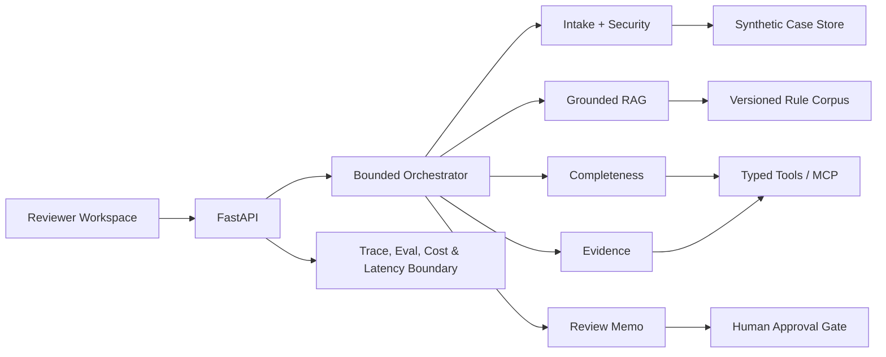

# PrüfPilot v2 - Agentic Document AI für öffentliche Prüfprozesse

> Unabhängige Bewerbungs-Arbeitsprobe für die AI-Engineer-Rolle bei aconium.  
> Kein allgemeiner PDF-Chat, sondern ein enger, prüfbarer Phase-1-Prototyp für Document AI.

**Live-Demo:** https://mikelninh.github.io/pruefpilot/  
**Demo-Fall:** `GF-2026-014` - vollständig synthetischer Verwendungsnachweis in der Gigabitförderung.

## Die Produktthese

aconium unterstützt den öffentlichen Sektor und administriert komplexe Förder- und Infrastrukturprojekte. Die ausgeschriebene Rolle soll Document AI als agentisches Dokumentenverarbeitungssystem aufbauen, das Prüfer:innen täglich unterstützt. Deshalb muss das Produkt vor allem:

- Dokumente zuverlässig aufnehmen, klassifizieren und prüfen,
- Regeln und Dokumentversionen nachvollziehbar zitieren,
- Widersprüche und fehlende Nachweise sichtbar machen,
- in bestehende Prüfworkflows passen,
- Unsicherheit eskalieren statt verstecken,
- die fachliche Entscheidung beim Menschen lassen.

Details: [`docs/aconium-fit.md`](docs/aconium-fit.md)

## Was v2 zusätzlich zeigt

- Reviewer-Queue mit priorisierten Fällen und nächster sinnvoller Aktion
- Intake-Pipeline mit Klassifikation, Schema-Validierung und Quarantäne
- Dokument-Prompt-Injection als expliziter Security-Test
- Grounded RAG mit Version, Seite, Abschnitt und Quellenlink
- Completeness- und Evidence-Agent mit strukturierten Ausgaben
- Prüfvermerk mit Human-Approval-Gate
- Phase-1-Mapping von Ausschreibung zu Implementierung und Production Next Step
- Eval-Dashboard und ehrliche Grenzen
- austauschbare Model-Provider-Grenze für OpenAI, Mistral oder Open Source

## Architektur



## Schnellstart

```bash
python -m venv .venv
source .venv/bin/activate  # Windows: .venv\Scripts\activate
pip install -e ".[dev]"
python scripts/generate_demo_pdfs.py
pytest -q
python evals/run_evals.py
uvicorn app.main:app --reload
```

Dann `http://localhost:8000` öffnen.

### Docker

```bash
docker compose up --build
```

## API

| Methode | Endpoint | Zweck |
|---|---|---|
| GET | `/health` | Health / readiness |
| GET | `/api/queue` | Priorisierte Reviewer-Queue |
| POST | `/api/cases/GF-2026-014/intake` | Klassifikation, Schema und Security-Scan |
| POST | `/api/cases/GF-2026-014/ask` | Grounded RAG |
| POST | `/api/cases/GF-2026-014/completeness` | Pflichtunterlagen prüfen |
| POST | `/api/cases/GF-2026-014/evidence` | Aussage gegen Belege prüfen |
| POST | `/api/cases/GF-2026-014/review-memo` | Prüfvermerk entwerfen |
| GET | `/api/evals` | Test- und Eval-Zusammenfassung |
| GET | `/api/phase-one` | Rolle → Implementierung → Production Next |

## MCP Tools

- `search_requirements`
- `classify_case_documents`
- `list_missing_documents`
- `compare_claim_to_evidence`
- `draft_review_memo`
- `get_reviewer_queue`

## Sicherheits- und Produktgrenzen

- keine autonome Förderentscheidung
- keine externen Aktionen
- keine echten personenbezogenen Daten
- untrusted document content wird nicht als Systemanweisung behandelt
- Grounding Guard bei fehlender Quelle
- strukturierte und validierte Outputs
- sichtbare Tool-Traces und menschliche Freigabe

## Tests und Evaluation

```bash
pytest -q
python evals/run_evals.py
```

Aktueller Stand: **14/14 Tests** und **10/10 Retrieval-Evals** bestanden.

Der öffentliche Demo-Modus ist deterministisch und benötigt keinen API-Key. Das vermeidet eine fragile Bewerbungsdemo und trennt die Produktlogik sauber von der Modellwahl.

## Ehrliche Grenzen

- kuratierte Regelzusammenfassungen statt vollständigem OCR-/Vektorkorpus
- ein vollständig ausgearbeiteter Demo-Fall
- lexical BM25 statt produktivem Hybrid Retrieval + Reranking
- noch kein SSO, RBAC, Queue, Object Storage oder echtes DMS
- keine Provider-Benchmarks ohne private Credentials und belastbaren Eval-Korpus

Production Roadmap: [`docs/production-roadmap.md`](docs/production-roadmap.md)

## Quellen und Disclaimer

Offizielle Quellen stehen in [`data/source_manifest.json`](data/source_manifest.json). Alle Fall- und Antragstellerdaten sind synthetisch. PrüfPilot ist eine unabhängige Arbeitsprobe und nicht mit aconium verbunden.

## Autor

Michael Ninh · Berlin  
[GitHub](https://github.com/mikelninh) · [LinkedIn](https://www.linkedin.com/in/michael-ninh)
