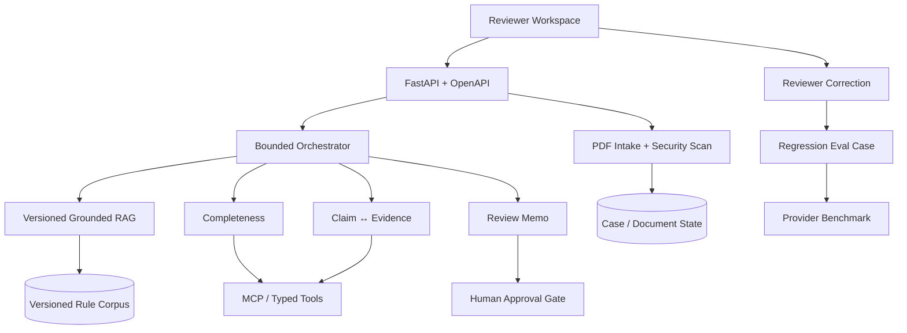

# PrüfPilot v3 — Agentic Document AI für öffentliche Prüfprozesse

> Unabhängige Bewerbungs-Arbeitsprobe für die AI-Engineer-Rolle bei aconium.  
> Kein allgemeiner PDF-Chat, sondern ein enger, messbarer Reviewer-Workflow für Document AI.

**Visuelle Live-App:** https://pruefpilot-aconium.vercel.app  
**Öffentliches FastAPI-Backend:** https://pruefpilot-document-ai.vercel.app  
**Interaktive OpenAPI-Dokumentation:** https://pruefpilot-document-ai.vercel.app/api/docs  
**Statische Fallback-Demo:** https://mikelninh.github.io/pruefpilot/  
**Demo-Fall:** `GF-2026-014`, eine vollständig synthetische Gigabit-Förderakte.

## Der eine Satz

> Ich habe Ihre Phase-1-Aufgabe in ein kleines, prüferorientiertes Produkt übersetzt: einen begrenzten Document-AI-Workflow mit echtem PDF-Intake, quellenbasiertem RAG, Beleg- und Vollständigkeitsprüfungen, MCP-Tools, FastAPI, Evaluations-Gates, Reviewer-Feedback und menschlicher Freigabe.

## Was v3 tatsächlich implementiert

### Reviewer-Produkt

- priorisierte Fall-Queue und empfohlener nächster Schritt
- synthetische Förderakte mit Pflichtunterlagen, Beträgen, Fristen und Nachweisen
- visueller Review-Workspace statt eines isolierten Chatfensters
- geführte 90-Sekunden-Produkttour

### Echter PDF-Intake

`POST /api/upload` verarbeitet reale PDF-Bytes:

1. Dateityp und Größenlimit prüfen
2. SHA-256 bilden
3. Text mit `pypdf` extrahieren
4. Dokumenttyp klassifizieren
5. Beträge, Datumsangaben und Rechnungsnummern extrahieren
6. document-borne Prompt Injection erkennen
7. strukturierte Ausgabe speichern und im Review-Workspace darstellen

### Grounded RAG und begrenzte Agents

- Retrieval über versionierte Regelabschnitte
- Zitate mit Titel, Version, Seite, Abschnitt und Quellenlink
- Grounding Guard bei fehlender Grundlage
- bounded Completeness-, Evidence- und Review-Workflows
- sichtbare Tool-Traces und Request IDs
- Human-Approval-Gate statt automatischer Förderentscheidung

### Reviewer-Feedback → Eval-Fall

Korrekturen werden über `POST /api/feedback` in ein reproduzierbares Eval-Format übersetzt. Die öffentliche Demo spiegelt Korrekturen zusätzlich im Browser, damit der Feedback-Loop trotz serverloser Instanzrotation sichtbar bleibt.

### Ehrlicher Provider-Benchmark

Die Architektur enthält Adapter für:

- deterministic baseline — reproduzierbar und öffentlich messbar
- OpenAI — nur bei konfiguriertem Credential
- Mistral — nur bei konfiguriertem Credential
- selbst gehostetes OpenAI-kompatibles Modell — nur bei konfiguriertem Endpoint

Nicht ausgeführte Provider erhalten **keine erfundenen Scores und keine geratenen Kosten**. Der öffentliche Smoke-Benchmark misst sechs transparente Fixtures; der vollständige lokale Harness enthält zwölf Gold-Fälle für Dokumenttyp, Beträge und Prompt-Injection-Erkennung.

### Produktionspfad

- Docker und Docker Compose
- GitHub Actions für Tests und Retrieval-Evals
- öffentliches FastAPI-Deployment
- SQLite-Persistenz lokal und explizit begrenzter serverloser Demo-State
- Postgres-Schema für Fälle, Dokumente, Feedback und Agent Runs
- Provider-, Storage- und MCP-Grenzen als austauschbare Verträge

## Architektur



## Öffentliche API

| Methode | Endpoint | Zweck |
|---|---|---|
| GET | `/api/health` | Health, Version, Provider- und Persistenzstatus |
| GET | `/api/queue` | priorisierte Reviewer-Queue |
| POST | `/api/upload` | echter PDF-Intake |
| POST | `/api/cases/GF-2026-014/ask` | grounded Q&A |
| POST | `/api/cases/GF-2026-014/completeness` | Pflichtunterlagen prüfen |
| POST | `/api/cases/GF-2026-014/evidence` | Aussage gegen Belege prüfen |
| POST | `/api/cases/GF-2026-014/review-memo` | Prüfvermerk entwerfen |
| POST | `/api/feedback` | Reviewer-Korrektur in Eval-Fall überführen |
| GET | `/api/feedback` | gespeicherte Korrekturen lesen |
| GET | `/api/benchmark` | gemessene Baseline und Provider-Status |
| GET | `/api/phase-one` | Rolle → Implementierung → Production Next |

## Schnellstart

```bash
python -m venv .venv
source .venv/bin/activate  # Windows: .venv\Scripts\activate
pip install -e ".[dev]"
pytest -q
python evals/run_evals.py
uvicorn app.main:app --reload
```

Danach:

- Produkt: http://localhost:8000
- OpenAPI: http://localhost:8000/api/docs

### Docker

```bash
docker compose up --build
```

## MCP

```bash
pip install -e ".[mcp]"
python -m app.mcp_server
```

Tools:

- `get_reviewer_queue`
- `search_requirements`
- `list_missing_documents`
- `compare_claim_to_evidence`
- `draft_review_memo`

## Sicherheitsgrenzen

- keine autonome Förderentscheidung
- keine externen Aktionen aus Dokumentinhalten
- keine echten personenbezogenen Demo-Daten
- Uploadlimit und PDF-Signaturprüfung
- document-borne instructions bleiben untrusted content
- Prompt-Injection-Funde werden quarantänisiert
- strukturierte Outputs und sichtbare Unsicherheit
- versionierte Quellen und Grounding Guard
- menschliche Freigabe bleibt erforderlich

Siehe [`docs/threat-model.md`](docs/threat-model.md).

## Persistenz — ehrlich getrennt

Die lokale Docker-Version nutzt dauerhaftes SQLite. Auf dem öffentlichen serverlosen Backend ist der Dateisystem-State instanzlokal; deshalb zeigt die öffentliche Demo diesen Status offen und spiegelt Reviewer-Korrekturen im Browser. Das Repo enthält ein Postgres-Schema und eine Adaptergrenze für einen echten Pilotbetrieb. Es wird nicht behauptet, dass die öffentliche Demo bereits ein mandantenfähiges DMS ist.

Siehe [`db/schema.sql`](db/schema.sql) und [`docs/production-roadmap.md`](docs/production-roadmap.md).

## Tests und Evaluationen

Lokal verifiziert:

- **18/18 Unit- und API-Tests bestanden**
- **10/10 Retrieval-Evaluationen bestanden**

Gemessen werden unter anderem:

- Dokumentklassifikation auf festen Gold-Fällen
- Betrags-Extraktion
- Prompt-Injection-Recall
- Top-1-Regelretrieval
- Grounding Guard
- Human-Approval-Grenze
- Feedback-zu-Eval-Konvertierung
- API-Verträge und realer PDF-Upload

## Bekannte Grenzen

- kuratierte Regelbasis statt vollständigem produktivem OCR-/Vektorkorpus
- ein vollständig ausgearbeiteter Demo-Fall
- noch kein SSO, RBAC, Mandantenmodell oder produktives DMS
- öffentliches Serverless-Dateisystem ist nicht dauerhaft
- externe Modellprovider werden erst nach kontrolliertem Lauf bewertet

## Quellen und Disclaimer

Die fachliche Produktthese basiert auf offiziellen aconium-Seiten zur AI-Engineer-Rolle, Fördermittelprüfung, Finanzprüfung und öffentlichen Digitalisierung sowie auf offiziellen Gigabit-Förderunterlagen. Die URLs stehen in [`data/source_manifest.json`](data/source_manifest.json).

Alle Fall-, Personen- und Projektdaten sind synthetisch. PrüfPilot ist nicht mit aconium verbunden.

## Autor

Michael Ninh · Berlin  
[GitHub](https://github.com/mikelninh) · [LinkedIn](https://www.linkedin.com/in/michael-ninh)
