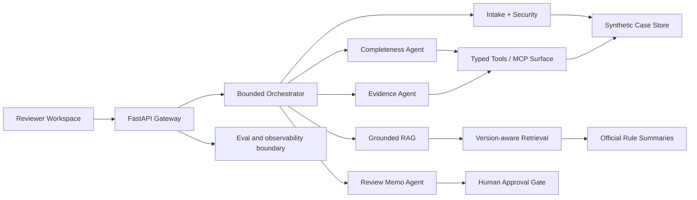

# Architecture

## Boundaries

- Maximum five logical tool calls per workflow.
- Structured Pydantic outputs.
- Version and page metadata on every rule citation.
- Untrusted document text is never treated as agent instruction.
- No external action, payment, notification or funding decision.
- Synthetic case data only.
- Deterministic fallback so the public demo runs without an API key.
